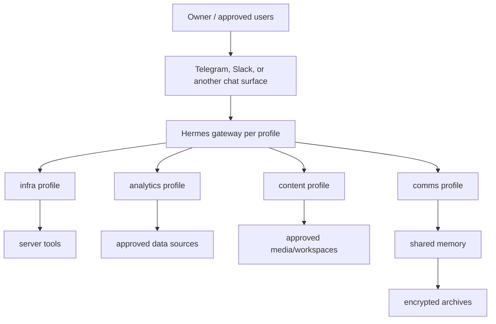

# Reference Architecture

## Components

| Component | Responsibility |
| --- | --- |
| Server host | Always-on machine, remote access, backups, launch manager |
| Hermes runtime | Starts profile gateways and dispatches work |
| Profiles | Role-specific instructions, memory, tools, and chat policy |
| Shared memory | Calibrated cross-profile facts and operating rules |
| Legacy memory | Historical evidence imported from previous agents |
| Archives | Encrypted backups of sessions, memories, projects, and configs |

## Autostart

Use the native init system:

- macOS: `launchd` LaunchDaemons/LaunchAgents.
- Linux: `systemd` user or system services.

Each profile should restart automatically and write logs to a predictable path.
